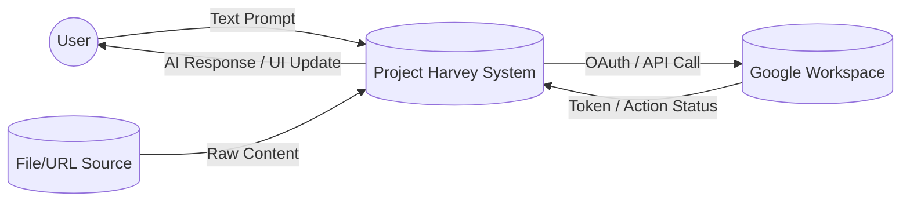
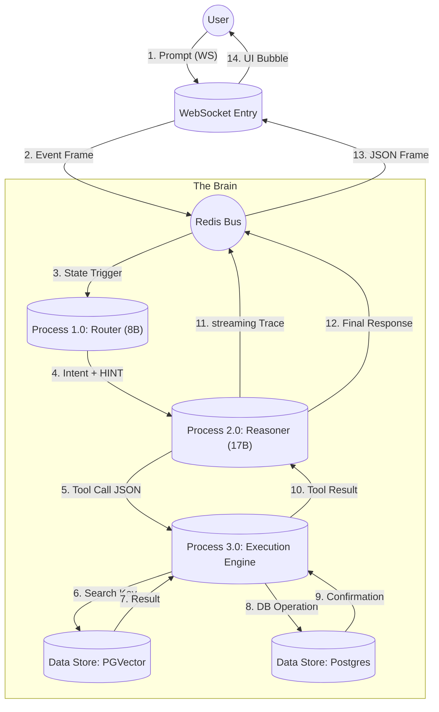
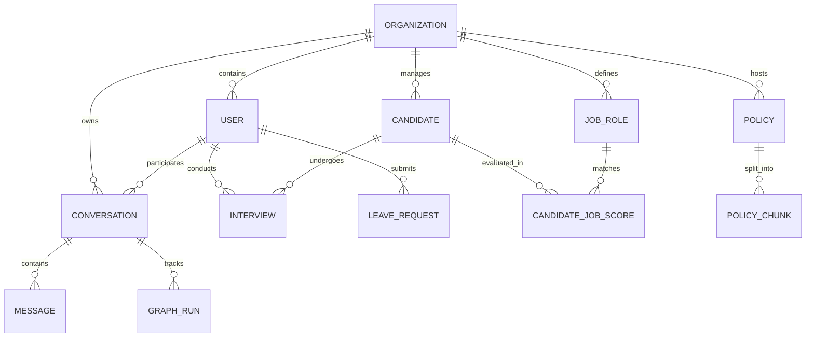
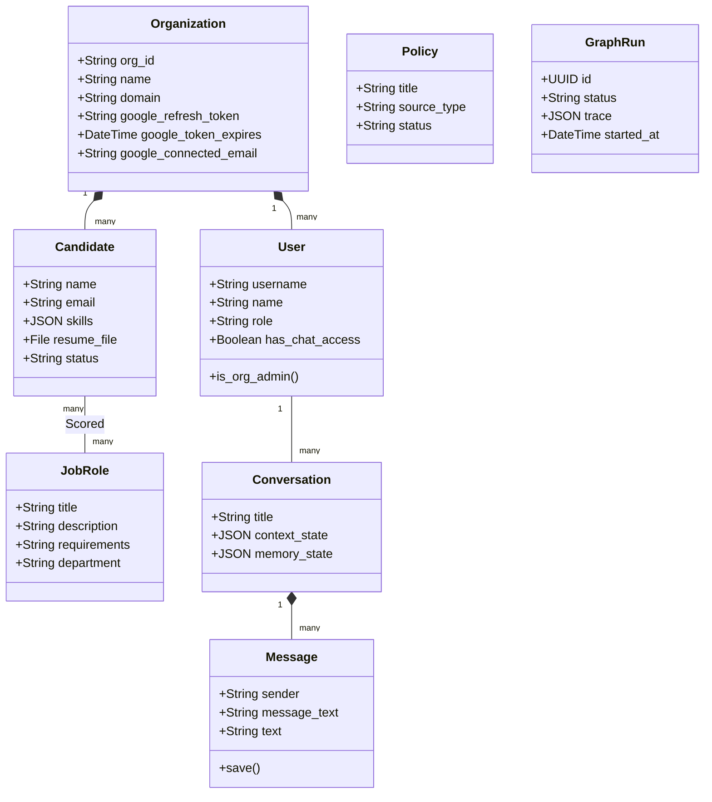

# Data Architecture & Schema Reference

This document provides a comprehensive overview of the data layer in Project Harvey, including the relational schema (DDL), Entity Relationship (ER) diagram, and UML Class diagrams.

---

## 1. Data Flow Diagrams (DFD)

### 1.1 Level 0: Context Diagram
The high-level interaction between the user, the system, and external entities.



### 1.2 Level 1: System Data Flow
A detailed view of how data flows through the internal AI and integration layers.



---

## 2. Entity Relationship (ER) Diagram
This diagram visualizes the relationships between the core entities: Organizations, Users, Candidates, and the AI Conversation state.



---

## 2. UML Class Diagram
A detailed view of the model properties and behavioral methods.



---

## 3. Data Definition Language (DDL)
Below is the high-level schema for the primary tables as represented in Postgres.

### 3.1 Core Identity & Multi-Tenancy
```sql
CREATE TABLE core_organization (
    id SERIAL PRIMARY KEY,
    org_id VARCHAR(50) UNIQUE NOT NULL,
    name VARCHAR(255) NOT NULL,
    domain VARCHAR(100) UNIQUE,
    google_refresh_token TEXT,
    created_at TIMESTAMP DEFAULT CURRENT_TIMESTAMP
);

CREATE TABLE core_user (
    id SERIAL PRIMARY KEY,
    username VARCHAR(150) UNIQUE NOT NULL,
    role VARCHAR(50) DEFAULT 'employee',
    organization_id INTEGER REFERENCES core_organization(id),
    has_chat_access BOOLEAN DEFAULT TRUE
);
```

### 3.2 Recruitment & Pipeline
```sql
CREATE TABLE core_candidate (
    id SERIAL PRIMARY KEY,
    organization_id INTEGER REFERENCES core_organization(id),
    name VARCHAR(255) NOT NULL,
    email VARCHAR(254) UNIQUE NOT NULL,
    skills JSONB,
    status VARCHAR(50) DEFAULT 'pending'
);

CREATE TABLE core_jobrole (
    id SERIAL PRIMARY KEY,
    organization_id INTEGER REFERENCES core_organization(id),
    title VARCHAR(255) NOT NULL,
    department VARCHAR(255)
);

CREATE TABLE core_interview (
    id SERIAL PRIMARY KEY,
    organization_id INTEGER REFERENCES core_organization(id),
    candidate_id INTEGER REFERENCES core_candidate(id),
    interviewer_id INTEGER REFERENCES core_user(id),
    date_time TIMESTAMP NOT NULL
);
```

### 3.3 AI & Audit (LangGraph)
```sql
CREATE TABLE core_conversation (
    id SERIAL PRIMARY KEY,
    user_id INTEGER REFERENCES core_user(id),
    context_state JSONB,
    memory_state JSONB
);

CREATE TABLE core_message (
    id SERIAL PRIMARY KEY,
    conversation_id INTEGER REFERENCES core_conversation(id),
    sender VARCHAR(10) NOT NULL,
    message_text TEXT NOT NULL -- Encrypted: enc:<payload>
);

CREATE TABLE core_graphrun (
    id UUID PRIMARY KEY,
    conversation_id INTEGER REFERENCES core_conversation(id),
    trace JSONB,
    status VARCHAR(20)
);
```

### 3.4 Vector Search (PGVector)
```sql
CREATE TABLE core_policychunk (
    id SERIAL PRIMARY KEY,
    policy_id UUID REFERENCES core_policy(id),
    text TEXT,
    vector_id VARCHAR(100), -- Linked to PGVector Index
    metadata JSONB
);
```
