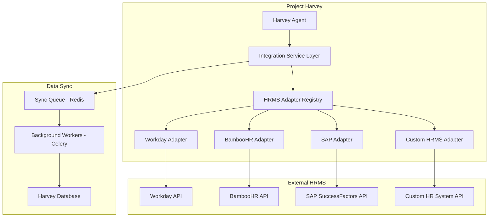
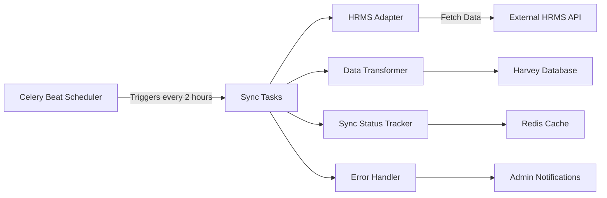

# HR System Integration Architecture for Project Harvey

## Overview

This document outlines the architecture for integrating Project Harvey with existing HR Management Systems (HRMS) like Workday, BambooHR, SAP SuccessFactors, or custom enterprise HR systems.

## Integration Architecture

### 1. **Integration Layer Components**



### 2. **Integration Patterns**

#### **Pattern A: Real-time Sync (For Demo Only)**
- Harvey queries HRMS APIs in real-time when data is needed
- Caches responses in Redis for performance (15-60 min TTL)
- **Best for:** Demo purposes, development environments
- **Limitations:** 
  - Higher latency for user interactions
  - Dependent on external API availability
  - More API calls = higher costs
  - Less control over data freshness

#### **Pattern B: Scheduled Batch Sync (⭐ RECOMMENDED for Production)**
> **This is the scalable and realistic approach for sensitive HR data**

- **How it works:**
  - Periodic background jobs (Celery/Django-Q) sync data from HRMS to Harvey's local database
  - Harvey operates entirely on local data copy
  - Sync runs every 1-6 hours (configurable based on data sensitivity)
  - Incremental sync using timestamps to fetch only changed records

- **Why this is best for HR data:**
  - ✅ **Data Sovereignty:** Full control over sensitive employee data
  - ✅ **Compliance:** Easier to implement data retention, GDPR, audit logs
  - ✅ **Performance:** Sub-second response times (no external API calls during queries)
  - ✅ **Reliability:** System works even if HRMS API is down
  - ✅ **Cost Effective:** Minimal API calls to external systems
  - ✅ **Offline Capability:** Harvey can function during HRMS maintenance windows
  - ✅ **Security:** Reduced attack surface (fewer real-time external connections)

- **Best for:** Production environments, large organizations, compliance-heavy industries

#### **Pattern C: Webhook-based Sync (Hybrid Approach)**
- HRMS pushes updates to Harvey via webhooks when data changes
- Harvey maintains near real-time data without polling
- Requires HRMS to support outbound webhooks
- **Best for:** Systems with webhook support, event-driven architectures

---

### **Recommended Implementation Strategy**

For your demo and production deployment:

1. **Demo Phase:** Use **Pattern A** with your mock API for quick iteration
2. **Production Phase:** Implement **Pattern B** for scalability and compliance
3. **Optional Enhancement:** Add **Pattern C** webhooks for critical real-time updates (e.g., emergency leave approvals)

---

## Mock APIs You Need to Build

For your demo, you'll need to create mock APIs that simulate the following HRMS endpoints:

### **1. Employee/User Management APIs**

#### `GET /api/v1/employees`
**Purpose:** List all employees in the organization

**Response:**
```json
{
  "data": [
    {
      "id": "EMP001",
      "employee_id": "EMP001",
      "first_name": "John",
      "last_name": "Doe",
      "email": "john.doe@company.com",
      "phone": "+91-9876543210",
      "department": "Engineering",
      "job_title": "Senior Software Engineer",
      "manager_id": "EMP100",
      "hire_date": "2022-01-15",
      "employment_status": "active",
      "location": "Bangalore",
      "work_type": "full_time"
    }
  ],
  "total": 150,
  "page": 1,
  "page_size": 50
}
```

#### `GET /api/v1/employees/{employee_id}`
**Purpose:** Get detailed information about a specific employee

**Response:**
```json
{
  "id": "EMP001",
  "employee_id": "EMP001",
  "first_name": "John",
  "last_name": "Doe",
  "email": "john.doe@company.com",
  "phone": "+91-9876543210",
  "department": "Engineering",
  "job_title": "Senior Software Engineer",
  "manager_id": "EMP100",
  "manager_name": "Jane Smith",
  "hire_date": "2022-01-15",
  "employment_status": "active",
  "location": "Bangalore",
  "work_type": "full_time",
  "skills": ["Python", "Django", "React", "AWS"],
  "certifications": ["AWS Solutions Architect"],
  "performance_rating": 4.5,
  "salary_band": "L5"
}
```

---

### **2. Job Requisition/Opening APIs**

#### `GET /api/v1/job-requisitions`
**Purpose:** List all open job positions

**Response:**
```json
{
  "data": [
    {
      "id": "JOB001",
      "requisition_id": "REQ-2026-001",
      "title": "Senior Backend Engineer",
      "department": "Engineering",
      "hiring_manager_id": "EMP100",
      "hiring_manager_name": "Jane Smith",
      "status": "open",
      "headcount": 2,
      "filled_positions": 0,
      "location": "Bangalore",
      "job_type": "full_time",
      "created_date": "2026-01-15",
      "target_hire_date": "2026-03-01"
    }
  ],
  "total": 12,
  "page": 1,
  "page_size": 20
}
```

#### `GET /api/v1/job-requisitions/{requisition_id}`
**Purpose:** Get detailed job description and requirements

**Response:**
```json
{
  "id": "JOB001",
  "requisition_id": "REQ-2026-001",
  "title": "Senior Backend Engineer",
  "department": "Engineering",
  "hiring_manager_id": "EMP100",
  "hiring_manager_name": "Jane Smith",
  "status": "open",
  "headcount": 2,
  "filled_positions": 0,
  "location": "Bangalore",
  "job_type": "full_time",
  "description": "We are looking for an experienced backend engineer...",
  "requirements": [
    "5+ years of Python experience",
    "Strong Django/FastAPI knowledge",
    "Experience with microservices",
    "Cloud platform experience (AWS/GCP)"
  ],
  "nice_to_have": [
    "Experience with LangChain/LangGraph",
    "ML/AI background"
  ],
  "salary_range": {
    "min": 2000000,
    "max": 3500000,
    "currency": "INR"
  },
  "created_date": "2026-01-15",
  "target_hire_date": "2026-03-01"
}
```

---

### **3. Candidate/Applicant APIs**

#### `GET /api/v1/candidates`
**Purpose:** List all candidates in the ATS (Applicant Tracking System)

**Response:**
```json
{
  "data": [
    {
      "id": "CAND001",
      "candidate_id": "CAND001",
      "first_name": "Alice",
      "last_name": "Johnson",
      "email": "alice.j@email.com",
      "phone": "+91-9123456789",
      "current_stage": "technical_interview",
      "applied_for_job_id": "JOB001",
      "applied_for_job_title": "Senior Backend Engineer",
      "source": "linkedin",
      "application_date": "2026-01-20",
      "status": "active"
    }
  ],
  "total": 45,
  "page": 1,
  "page_size": 20
}
```

#### `GET /api/v1/candidates/{candidate_id}`
**Purpose:** Get detailed candidate profile

**Response:**
```json
{
  "id": "CAND001",
  "candidate_id": "CAND001",
  "first_name": "Alice",
  "last_name": "Johnson",
  "email": "alice.j@email.com",
  "phone": "+91-9123456789",
  "current_stage": "technical_interview",
  "applied_for_job_id": "JOB001",
  "applied_for_job_title": "Senior Backend Engineer",
  "source": "linkedin",
  "application_date": "2026-01-20",
  "status": "active",
  "resume_url": "https://hrms.company.com/resumes/CAND001.pdf",
  "linkedin_url": "https://linkedin.com/in/alicejohnson",
  "skills": ["Python", "Django", "PostgreSQL", "Docker"],
  "experience_years": 6,
  "current_company": "Tech Corp",
  "current_title": "Backend Engineer",
  "education": [
    {
      "degree": "B.Tech",
      "field": "Computer Science",
      "institution": "IIT Delhi",
      "year": 2018
    }
  ],
  "interview_history": [
    {
      "interview_id": "INT001",
      "stage": "screening",
      "interviewer_id": "EMP050",
      "interviewer_name": "Bob Wilson",
      "date": "2026-01-25",
      "status": "passed",
      "feedback": "Strong technical background, good communication"
    }
  ]
}
```

#### `POST /api/v1/candidates`
**Purpose:** Create a new candidate in the HRMS

**Request:**
```json
{
  "first_name": "Alice",
  "last_name": "Johnson",
  "email": "alice.j@email.com",
  "phone": "+91-9123456789",
  "applied_for_job_id": "JOB001",
  "source": "referral",
  "resume_url": "https://storage.company.com/resumes/alice_resume.pdf",
  "linkedin_url": "https://linkedin.com/in/alicejohnson"
}
```

**Response:**
```json
{
  "id": "CAND001",
  "candidate_id": "CAND001",
  "status": "created",
  "message": "Candidate successfully added to the system"
}
```

---

### **4. Interview Scheduling APIs**

#### `GET /api/v1/interviews`
**Purpose:** List all scheduled interviews

**Response:**
```json
{
  "data": [
    {
      "id": "INT001",
      "interview_id": "INT001",
      "candidate_id": "CAND001",
      "candidate_name": "Alice Johnson",
      "job_id": "JOB001",
      "job_title": "Senior Backend Engineer",
      "interviewer_id": "EMP050",
      "interviewer_name": "Bob Wilson",
      "interviewer_email": "bob.wilson@company.com",
      "scheduled_date": "2026-02-15T14:00:00+05:30",
      "duration_minutes": 60,
      "interview_type": "technical",
      "status": "scheduled",
      "meeting_link": "https://meet.google.com/abc-defg-hij"
    }
  ],
  "total": 23,
  "page": 1,
  "page_size": 20
}
```

#### `POST /api/v1/interviews`
**Purpose:** Schedule a new interview

**Request:**
```json
{
  "candidate_id": "CAND001",
  "job_id": "JOB001",
  "interviewer_id": "EMP050",
  "scheduled_date": "2026-02-15T14:00:00+05:30",
  "duration_minutes": 60,
  "interview_type": "technical",
  "notes": "Focus on system design and Django expertise"
}
```

**Response:**
```json
{
  "id": "INT001",
  "interview_id": "INT001",
  "status": "scheduled",
  "meeting_link": "https://meet.google.com/abc-defg-hij",
  "calendar_event_id": "CAL123456",
  "message": "Interview successfully scheduled"
}
```

#### `PATCH /api/v1/interviews/{interview_id}`
**Purpose:** Update interview status or reschedule

**Request:**
```json
{
  "status": "completed",
  "feedback": "Candidate performed well in system design round",
  "rating": 4,
  "recommendation": "proceed_to_next_round"
}
```

---

### **5. Leave Management APIs**

#### `GET /api/v1/leave-requests`
**Purpose:** List leave requests

**Response:**
```json
{
  "data": [
    {
      "id": "LEAVE001",
      "leave_request_id": "LEAVE001",
      "employee_id": "EMP001",
      "employee_name": "John Doe",
      "leave_type": "annual",
      "start_date": "2026-03-01",
      "end_date": "2026-03-05",
      "total_days": 5,
      "status": "pending",
      "applied_date": "2026-02-10",
      "reason": "Family vacation"
    }
  ],
  "total": 8,
  "page": 1,
  "page_size": 20
}
```

#### `POST /api/v1/leave-requests`
**Purpose:** Submit a leave request

**Request:**
```json
{
  "employee_id": "EMP001",
  "leave_type": "annual",
  "start_date": "2026-03-01",
  "end_date": "2026-03-05",
  "reason": "Family vacation"
}
```

**Response:**
```json
{
  "id": "LEAVE001",
  "leave_request_id": "LEAVE001",
  "status": "pending",
  "message": "Leave request submitted successfully"
}
```

#### `GET /api/v1/employees/{employee_id}/leave-balance`
**Purpose:** Get employee's leave balance

**Response:**
```json
{
  "employee_id": "EMP001",
  "leave_balances": [
    {
      "leave_type": "annual",
      "total_allocated": 20,
      "used": 5,
      "pending": 5,
      "available": 10
    },
    {
      "leave_type": "sick",
      "total_allocated": 10,
      "used": 2,
      "pending": 0,
      "available": 8
    }
  ],
  "year": 2026
}
```

---

### **6. Department/Organization Structure APIs**

#### `GET /api/v1/departments`
**Purpose:** List all departments

**Response:**
```json
{
  "data": [
    {
      "id": "DEPT001",
      "department_id": "DEPT001",
      "name": "Engineering",
      "head_id": "EMP100",
      "head_name": "Jane Smith",
      "employee_count": 45,
      "location": "Bangalore"
    },
    {
      "id": "DEPT002",
      "department_id": "DEPT002",
      "name": "Product",
      "head_id": "EMP101",
      "head_name": "Mark Davis",
      "employee_count": 12,
      "location": "Bangalore"
    }
  ]
}
```

#### `GET /api/v1/employees/{employee_id}/reporting-chain`
**Purpose:** Get employee's reporting hierarchy

**Response:**
```json
{
  "employee_id": "EMP001",
  "employee_name": "John Doe",
  "reporting_chain": [
    {
      "level": 1,
      "employee_id": "EMP050",
      "name": "Bob Wilson",
      "title": "Engineering Manager"
    },
    {
      "level": 2,
      "employee_id": "EMP100",
      "name": "Jane Smith",
      "title": "VP Engineering"
    },
    {
      "level": 3,
      "employee_id": "EMP200",
      "name": "CEO Name",
      "title": "Chief Executive Officer"
    }
  ]
}
```

---

## Integration Service Implementation

### Directory Structure

```
project-harvey-test/
├── integrations/
│   ├── hrms/
│   │   ├── __init__.py
│   │   ├── base.py              # Base adapter interface
│   │   ├── registry.py          # Adapter registry
│   │   ├── adapters/
│   │   │   ├── __init__.py
│   │   │   ├── workday.py       # Workday adapter
│   │   │   ├── bamboohr.py      # BambooHR adapter
│   │   │   ├── sap.py           # SAP adapter
│   │   │   └── mock.py          # Mock adapter for demo
│   │   ├── sync/
│   │   │   ├── __init__.py
│   │   │   ├── tasks.py         # Celery tasks for sync
│   │   │   └── scheduler.py     # Sync scheduling logic
│   │   └── cache.py             # Redis caching layer
│   └── api/
│       ├── __init__.py
│       └── views.py             # Integration management endpoints
```

### Key Components to Build

#### 1. **Base Adapter Interface** (`integrations/hrms/base.py`)

```python
from abc import ABC, abstractmethod
from typing import List, Dict, Optional

class HRMSAdapter(ABC):
    """Base interface for all HRMS integrations"""
    
    def __init__(self, config: Dict):
        self.config = config
        self.base_url = config.get('base_url')
        self.auth_token = config.get('auth_token')
    
    @abstractmethod
    async def get_employees(self, page: int = 1, page_size: int = 50) -> Dict:
        """Fetch employees from HRMS"""
        pass
    
    @abstractmethod
    async def get_employee(self, employee_id: str) -> Dict:
        """Fetch single employee details"""
        pass
    
    @abstractmethod
    async def get_job_requisitions(self, status: str = 'open') -> Dict:
        """Fetch job openings"""
        pass
    
    @abstractmethod
    async def get_candidates(self, job_id: Optional[str] = None) -> Dict:
        """Fetch candidates"""
        pass
    
    @abstractmethod
    async def create_candidate(self, candidate_data: Dict) -> Dict:
        """Create new candidate in HRMS"""
        pass
    
    @abstractmethod
    async def schedule_interview(self, interview_data: Dict) -> Dict:
        """Schedule interview in HRMS"""
        pass
    
    @abstractmethod
    async def get_leave_requests(self, employee_id: Optional[str] = None) -> Dict:
        """Fetch leave requests"""
        pass
    
    @abstractmethod
    async def create_leave_request(self, leave_data: Dict) -> Dict:
        """Submit leave request"""
        pass
```

#### 2. **Mock Adapter** (`integrations/hrms/adapters/mock.py`)

This will connect to your mock API server.

```python
import httpx
from typing import Dict, Optional
from ..base import HRMSAdapter

class MockHRMSAdapter(HRMSAdapter):
    """Mock HRMS adapter for demo purposes"""
    
    async def get_employees(self, page: int = 1, page_size: int = 50) -> Dict:
        async with httpx.AsyncClient() as client:
            response = await client.get(
                f"{self.base_url}/api/v1/employees",
                params={"page": page, "page_size": page_size},
                headers={"Authorization": f"Bearer {self.auth_token}"}
            )
            return response.json()
    
    async def get_employee(self, employee_id: str) -> Dict:
        async with httpx.AsyncClient() as client:
            response = await client.get(
                f"{self.base_url}/api/v1/employees/{employee_id}",
                headers={"Authorization": f"Bearer {self.auth_token}"}
            )
            return response.json()
    
    # ... implement other methods similarly
```

#### 3. **Adapter Registry** (`integrations/hrms/registry.py`)

```python
from typing import Dict, Type
from .base import HRMSAdapter
from .adapters.mock import MockHRMSAdapter
from .adapters.workday import WorkdayAdapter
from .adapters.bamboohr import BambooHRAdapter

class HRMSAdapterRegistry:
    """Registry for HRMS adapters"""
    
    _adapters: Dict[str, Type[HRMSAdapter]] = {
        'mock': MockHRMSAdapter,
        'workday': WorkdayAdapter,
        'bamboohr': BambooHRAdapter,
    }
    
    @classmethod
    def get_adapter(cls, hrms_type: str, config: Dict) -> HRMSAdapter:
        """Get adapter instance for given HRMS type"""
        adapter_class = cls._adapters.get(hrms_type)
        if not adapter_class:
            raise ValueError(f"Unknown HRMS type: {hrms_type}")
        return adapter_class(config)
    
    @classmethod
    def register_adapter(cls, hrms_type: str, adapter_class: Type[HRMSAdapter]):
        """Register a new adapter"""
        cls._adapters[hrms_type] = adapter_class
```

#### 4. **Integration Service** (`integrations/hrms/service.py`)

```python
from typing import Optional, Dict
from core.models.recruitment import HRMSIntegrationConfig
from .registry import HRMSAdapterRegistry
from .cache import HRMSCache

class HRMSIntegrationService:
    """Main service for HRMS integration"""
    
    def __init__(self, organization_id: int):
        self.organization_id = organization_id
        self.cache = HRMSCache()
        self._adapter = None
    
    def _get_adapter(self):
        """Get configured adapter for organization"""
        if self._adapter:
            return self._adapter
        
        config = HRMSIntegrationConfig.objects.filter(
            organization_id=self.organization_id,
            is_active=True
        ).first()
        
        if not config:
            raise ValueError("No active HRMS integration configured")
        
        adapter_config = {
            'base_url': config.base_url,
            'auth_token': config.auth_token,
        }
        
        self._adapter = HRMSAdapterRegistry.get_adapter(
            config.hrms_type, 
            adapter_config
        )
        return self._adapter
    
    async def sync_employees(self):
        """Sync employees from HRMS to Harvey"""
        adapter = self._get_adapter()
        employees_data = await adapter.get_employees()
        
        # Transform and save to Harvey's database
        # ... implementation
        
        return employees_data
    
    async def get_employee_by_email(self, email: str) -> Optional[Dict]:
        """Get employee from HRMS by email"""
        cache_key = f"employee:email:{email}"
        
        # Check cache first
        cached = await self.cache.get(cache_key)
        if cached:
            return cached
        
        adapter = self._get_adapter()
        # In real implementation, you'd search by email
        # For now, fetch all and filter (not efficient, just for demo)
        employees = await adapter.get_employees()
        
        for emp in employees.get('data', []):
            if emp['email'] == email:
                await self.cache.set(cache_key, emp, ttl=3600)
                return emp
        
        return None
```

---

## Pattern B: Batch Sync Implementation (Production-Ready)

### Overview

This section provides a complete implementation of **Pattern B (Scheduled Batch Sync)** - the recommended approach for production environments handling sensitive HR data.

### Architecture Components



### 1. **Celery Configuration** (`project_harvey/celery.py`)

```python
import os
from celery import Celery
from celery.schedules import crontab

os.environ.setdefault('DJANGO_SETTINGS_MODULE', 'project_harvey.settings')

app = Celery('project_harvey')
app.config_from_object('django.conf:settings', namespace='CELERY')
app.autodiscover_tasks()

# Celery Beat Schedule for HRMS Sync
app.conf.beat_schedule = {
    'sync-employees-every-2-hours': {
        'task': 'integrations.hrms.sync.tasks.sync_all_employees',
        'schedule': crontab(minute=0, hour='*/2'),  # Every 2 hours
    },
    'sync-candidates-every-hour': {
        'task': 'integrations.hrms.sync.tasks.sync_all_candidates',
        'schedule': crontab(minute=0),  # Every hour
    },
    'sync-interviews-every-30-min': {
        'task': 'integrations.hrms.sync.tasks.sync_all_interviews',
        'schedule': crontab(minute='*/30'),  # Every 30 minutes
    },
    'sync-leave-requests-daily': {
        'task': 'integrations.hrms.sync.tasks.sync_all_leave_requests',
        'schedule': crontab(minute=0, hour=1),  # Daily at 1 AM
    },
}

app.conf.timezone = 'Asia/Kolkata'
```

### 2. **Sync Tasks** (`integrations/hrms/sync/tasks.py`)

```python
from celery import shared_task
from django.utils import timezone
from core.models.organization import Organization
from core.models.recruitment import Candidate, Interview, LeaveRequest
from integrations.hrms.service import HRMSIntegrationService
from integrations.hrms.sync.tracker import SyncStatusTracker
import logging

logger = logging.getLogger(__name__)

@shared_task(bind=True, max_retries=3)
def sync_all_employees(self):
    """Sync employees for all organizations with active HRMS integration"""
    tracker = SyncStatusTracker()
    
    for org in Organization.objects.filter(hrms_configs__is_active=True).distinct():
        try:
            sync_organization_employees.delay(org.id)
        except Exception as e:
            logger.error(f"Failed to queue employee sync for org {org.id}: {str(e)}")

@shared_task(bind=True, max_retries=3)
def sync_organization_employees(self, org_id: int):
    """Sync employees for a specific organization"""
    tracker = SyncStatusTracker()
    sync_id = tracker.start_sync(org_id, 'employees')
    
    try:
        service = HRMSIntegrationService(org_id)
        adapter = service._get_adapter()
        
        # Fetch last sync timestamp for incremental sync
        last_sync = tracker.get_last_sync_time(org_id, 'employees')
        
        page = 1
        total_synced = 0
        
        while True:
            # Fetch employees from HRMS
            response = await adapter.get_employees(page=page, page_size=100)
            employees = response.get('data', [])
            
            if not employees:
                break
            
            # Transform and save to Harvey's database
            for emp_data in employees:
                # Check if employee was updated after last sync (incremental)
                emp_updated_at = emp_data.get('updated_at')
                if last_sync and emp_updated_at and emp_updated_at < last_sync:
                    continue  # Skip unchanged records
                
                # Upsert employee data
                from core.models.organization import User
                User.objects.update_or_create(
                    email=emp_data['email'],
                    organization_id=org_id,
                    defaults={
                        'username': emp_data['email'],
                        'first_name': emp_data.get('first_name', ''),
                        'last_name': emp_data.get('last_name', ''),
                        'phone': emp_data.get('phone'),
                        # Map other fields as needed
                    }
                )
                total_synced += 1
            
            # Check if there are more pages
            if len(employees) < 100:
                break
            page += 1
        
        tracker.complete_sync(sync_id, total_synced)
        logger.info(f"Successfully synced {total_synced} employees for org {org_id}")
        
    except Exception as e:
        tracker.fail_sync(sync_id, str(e))
        logger.error(f"Employee sync failed for org {org_id}: {str(e)}")
        raise self.retry(exc=e, countdown=60 * 5)  # Retry after 5 minutes

@shared_task(bind=True, max_retries=3)
def sync_all_candidates(self):
    """Sync candidates for all organizations"""
    for org in Organization.objects.filter(hrms_configs__is_active=True).distinct():
        try:
            sync_organization_candidates.delay(org.id)
        except Exception as e:
            logger.error(f"Failed to queue candidate sync for org {org.id}: {str(e)}")

@shared_task(bind=True, max_retries=3)
def sync_organization_candidates(self, org_id: int):
    """Sync candidates for a specific organization"""
    tracker = SyncStatusTracker()
    sync_id = tracker.start_sync(org_id, 'candidates')
    
    try:
        service = HRMSIntegrationService(org_id)
        adapter = service._get_adapter()
        
        response = await adapter.get_candidates()
        candidates = response.get('data', [])
        
        total_synced = 0
        for cand_data in candidates:
            Candidate.objects.update_or_create(
                email=cand_data['email'],
                organization_id=org_id,
                defaults={
                    'name': f"{cand_data.get('first_name', '')} {cand_data.get('last_name', '')}",
                    'phone': cand_data.get('phone'),
                    'status': cand_data.get('status', 'pending'),
                    'source': cand_data.get('source', 'hrms_sync'),
                    'skills': cand_data.get('skills', []),
                }
            )
            total_synced += 1
        
        tracker.complete_sync(sync_id, total_synced)
        logger.info(f"Successfully synced {total_synced} candidates for org {org_id}")
        
    except Exception as e:
        tracker.fail_sync(sync_id, str(e))
        logger.error(f"Candidate sync failed for org {org_id}: {str(e)}")
        raise self.retry(exc=e, countdown=60 * 5)

@shared_task(bind=True, max_retries=3)
def sync_all_interviews(self):
    """Sync interviews for all organizations"""
    for org in Organization.objects.filter(hrms_configs__is_active=True).distinct():
        sync_organization_interviews.delay(org.id)

@shared_task(bind=True, max_retries=3)
def sync_organization_interviews(self, org_id: int):
    """Sync interviews for a specific organization"""
    # Similar implementation to candidates
    pass

@shared_task(bind=True, max_retries=3)
def sync_all_leave_requests(self):
    """Sync leave requests for all organizations"""
    for org in Organization.objects.filter(hrms_configs__is_active=True).distinct():
        sync_organization_leave_requests.delay(org.id)
```

### 3. **Sync Status Tracker** (`integrations/hrms/sync/tracker.py`)

```python
from django.core.cache import cache
from django.utils import timezone
from datetime import datetime
import uuid

class SyncStatusTracker:
    """Track sync status and history in Redis"""
    
    def start_sync(self, org_id: int, entity_type: str) -> str:
        """Start a new sync operation"""
        sync_id = str(uuid.uuid4())
        
        sync_data = {
            'sync_id': sync_id,
            'org_id': org_id,
            'entity_type': entity_type,
            'status': 'running',
            'started_at': timezone.now().isoformat(),
            'records_synced': 0,
        }
        
        cache.set(f"hrms_sync:{sync_id}", sync_data, timeout=3600)
        cache.set(f"hrms_sync_latest:{org_id}:{entity_type}", sync_id, timeout=86400)
        
        return sync_id
    
    def complete_sync(self, sync_id: str, records_synced: int):
        """Mark sync as completed"""
        sync_data = cache.get(f"hrms_sync:{sync_id}")
        if sync_data:
            sync_data.update({
                'status': 'completed',
                'completed_at': timezone.now().isoformat(),
                'records_synced': records_synced,
            })
            cache.set(f"hrms_sync:{sync_id}", sync_data, timeout=86400)
            
            # Update last successful sync time
            org_id = sync_data['org_id']
            entity_type = sync_data['entity_type']
            cache.set(
                f"hrms_last_sync:{org_id}:{entity_type}",
                timezone.now().isoformat(),
                timeout=None  # Never expire
            )
    
    def fail_sync(self, sync_id: str, error: str):
        """Mark sync as failed"""
        sync_data = cache.get(f"hrms_sync:{sync_id}")
        if sync_data:
            sync_data.update({
                'status': 'failed',
                'failed_at': timezone.now().isoformat(),
                'error': error,
            })
            cache.set(f"hrms_sync:{sync_id}", sync_data, timeout=86400)
    
    def get_last_sync_time(self, org_id: int, entity_type: str) -> datetime:
        """Get timestamp of last successful sync"""
        last_sync_str = cache.get(f"hrms_last_sync:{org_id}:{entity_type}")
        if last_sync_str:
            return datetime.fromisoformat(last_sync_str)
        return None
    
    def get_sync_status(self, sync_id: str) -> dict:
        """Get status of a specific sync operation"""
        return cache.get(f"hrms_sync:{sync_id}")
```

### 4. **Admin Monitoring Dashboard**

Add to Django admin to monitor sync status:

```python
# adminpanel/views.py or integrations/api/views.py

from django.contrib.admin.views.decorators import staff_member_required
from django.shortcuts import render
from integrations.hrms.sync.tracker import SyncStatusTracker

@staff_member_required
def hrms_sync_dashboard(request):
    """Admin dashboard to monitor HRMS sync status"""
    tracker = SyncStatusTracker()
    
    # Get sync status for all organizations
    from core.models.organization import Organization
    
    sync_statuses = []
    for org in Organization.objects.filter(hrms_configs__is_active=True):
        for entity_type in ['employees', 'candidates', 'interviews', 'leave_requests']:
            last_sync = tracker.get_last_sync_time(org.id, entity_type)
            sync_statuses.append({
                'organization': org.name,
                'entity_type': entity_type,
                'last_sync': last_sync,
                'status': 'healthy' if last_sync else 'never_synced'
            })
    
    return render(request, 'admin/hrms_sync_dashboard.html', {
        'sync_statuses': sync_statuses
    })
```

### 5. **Production Considerations**

#### **Security**
- ✅ Store HRMS credentials encrypted in database
- ✅ Use environment variables for sensitive config
- ✅ Implement API rate limiting to avoid overwhelming HRMS
- ✅ Add IP whitelisting if HRMS supports it

#### **Performance**
- ✅ Use incremental sync (only fetch changed records)
- ✅ Implement pagination for large datasets
- ✅ Use database bulk operations (`bulk_create`, `bulk_update`)
- ✅ Add database indexes on frequently queried fields

#### **Reliability**
- ✅ Implement retry logic with exponential backoff
- ✅ Add dead letter queue for failed syncs
- ✅ Monitor sync health with alerts
- ✅ Implement circuit breaker pattern for HRMS API failures

#### **Compliance**
- ✅ Log all sync operations for audit trail
- ✅ Implement data retention policies
- ✅ Add GDPR-compliant data deletion
- ✅ Encrypt sensitive data at rest

---

## Harvey Tool Updates

You'll need to update Harvey's existing tools to use the integration service:

### Updated `schedule_interview` tool

```python
from integrations.hrms.service import HRMSIntegrationService

@tool
async def schedule_interview(
    candidate_id: str,
    interviewer_id: str,
    date_time: str,
    organization_id: int
) -> str:
    """Schedule an interview in both Harvey and the HRMS"""
    
    # Create in Harvey's database (existing logic)
    # ...
    
    # Sync to HRMS
    try:
        hrms_service = HRMSIntegrationService(organization_id)
        adapter = hrms_service._get_adapter()
        
        interview_data = {
            "candidate_id": candidate_id,
            "interviewer_id": interviewer_id,
            "scheduled_date": date_time,
            "duration_minutes": 60,
            "interview_type": "technical"
        }
        
        result = await adapter.schedule_interview(interview_data)
        
        return f"Interview scheduled successfully. Meeting link: {result.get('meeting_link')}"
    except Exception as e:
        return f"Interview created in Harvey, but HRMS sync failed: {str(e)}"
```

---

## Summary: Mock APIs to Build

Create a simple FastAPI or Flask server with these endpoints:

### **Core Endpoints (Priority 1 - Essential for Demo)**
1. `GET /api/v1/employees` - List employees
2. `GET /api/v1/employees/{id}` - Get employee details
3. `GET /api/v1/candidates` - List candidates
4. `GET /api/v1/candidates/{id}` - Get candidate details
5. `POST /api/v1/candidates` - Create candidate
6. `GET /api/v1/job-requisitions` - List jobs
7. `GET /api/v1/job-requisitions/{id}` - Get job details
8. `POST /api/v1/interviews` - Schedule interview
9. `GET /api/v1/interviews` - List interviews

### **Secondary Endpoints (Priority 2 - Nice to Have)**
10. `GET /api/v1/leave-requests` - List leave requests
11. `POST /api/v1/leave-requests` - Create leave request
12. `GET /api/v1/departments` - List departments
13. `GET /api/v1/employees/{id}/leave-balance` - Get leave balance

### **Authentication**
- Use simple Bearer token authentication
- Token: `mock-hrms-token-12345`

This will give you a complete integration layer that demonstrates real-world HRMS connectivity!
