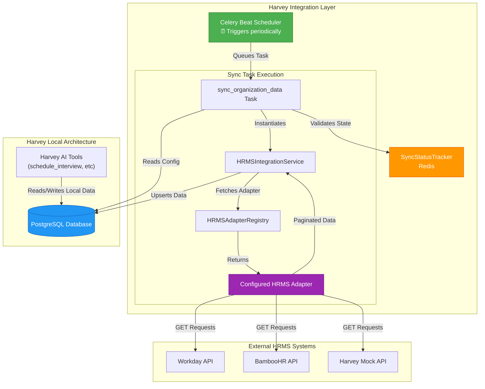
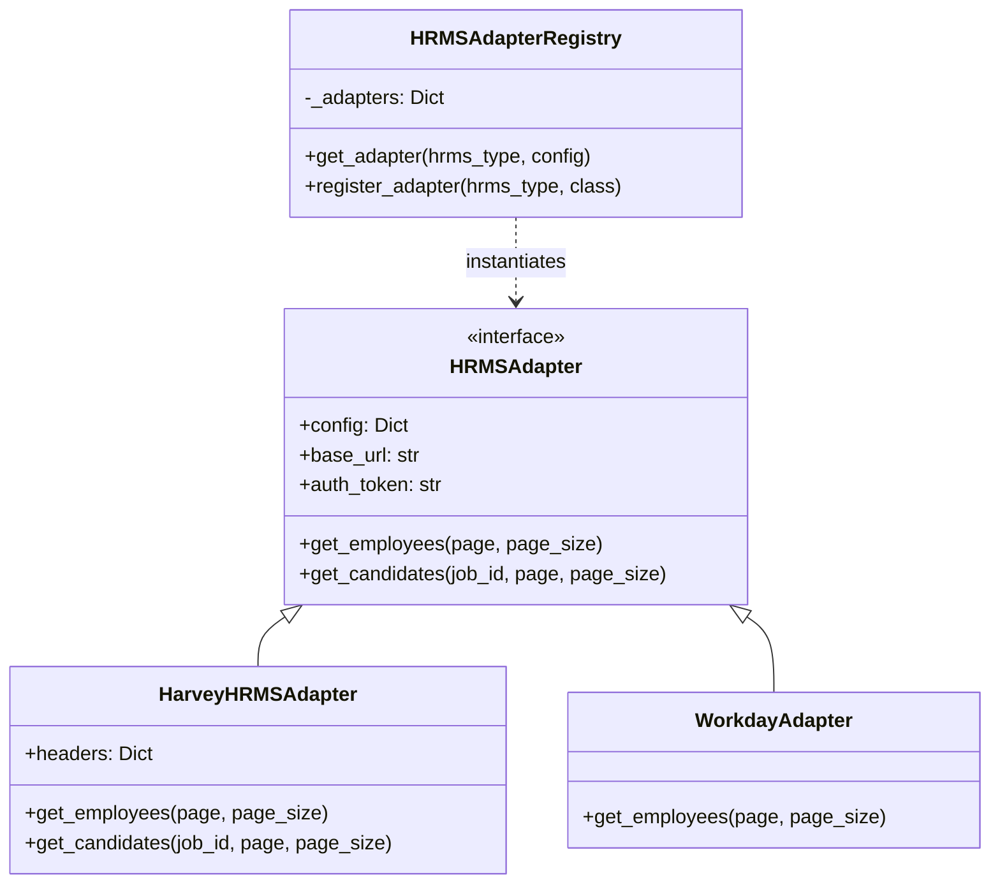
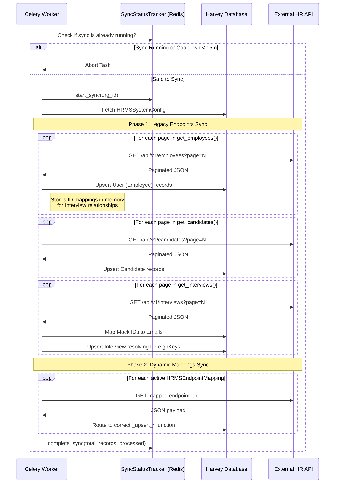

# HR System Integration Architecture (Detailed)

## Overview

Project Harvey integrates with external HR Management Systems (HRMS) like Workday, BambooHR, and Custom APIs through a **Scheduled Batch Sync** architecture. This architecture utilizes Celery background workers to pull data from external systems into Harvey's local database, ensuring rapid API responses, offline capabilities, and strict data sovereignty.

---

## 🏗️ 1. High-Level Architecture

```mermaid
graph TB
    subgraph "External HRMS Systems"
        API1[Workday API]
        API2[BambooHR API]
        API3[Harvey Mock API]
    end

    subgraph "Harvey Integration Layer"
        SCHEDULER[Celery Beat Scheduler<br/>⏰ Triggers periodically]
        
        subgraph "Sync Task Execution"
            TASK[sync_organization_data Task]
            SERVICE[HRMSIntegrationService]
            REGISTRY[HRMSAdapterRegistry]
            ADAPTER[Configured HRMS Adapter]
        end
        
        TRACKER[SyncStatusTracker<br/>Redis]
    end

    subgraph "Harvey Local Architecture"
        DB[(PostgreSQL Database)]
        TOOLS["Harvey AI Tools<br/>(schedule_interview, etc)"]
    end

    SCHEDULER -->|Queues Task| TASK
    TASK -->|Reads Config| DB
    TASK -->|Validates State| TRACKER
    TASK -->|Instantiates| SERVICE
    SERVICE -->|Fetches Adapter| REGISTRY
    REGISTRY -->|Returns| ADAPTER
    
    ADAPTER -->|GET Requests| API1 & API2 & API3
    ADAPTER -->|Paginated Data| SERVICE
    SERVICE -->|Upserts Data| DB
    
    TOOLS -->|Reads/Writes Local Data| DB
    
    style SCHEDULER fill:#4CAF50,stroke:#2E7D32,color:#fff
    style DB fill:#2196F3,stroke:#1565C0,color:#fff
    style TRACKER fill:#FF9800,stroke:#E65100,color:#fff
    style ADAPTER fill:#9C27B0,stroke:#6A1B9A,color:#fff
```

---

## ⚙️ 2. Core Integration Models

To enforce tenant isolation, all synchronization settings are strictly linked to the `Organization` model.

### `HRMSSystemConfig`
The primary authentication and routing table for an organization's HRMS.
- **`hrms_type`**: Identifies which adapter to load (e.g., `harvey`, `workday`).
- **`base_url` & `auth_token`**: Connection credentials (the `auth_token` is an `EncryptedCharField`, meaning it is encrypted at rest).
- **Legacy Endpoints**: Standard routes for basic entities (`departments_endpoint`, `employees_endpoint`, `jobs_endpoint`, etc.). Typically `/api/v1/employees`.
- **Security Lock (`edit_token`)**: A 16-character token generator is required to unlock this configuration in the Admin UI, valid for strictly 24 hours.

### `HRMSEndpointMapping`
Allows administrators to map arbitrary external API endpoints to Harvey's internal datastore dynamically.
- **`endpoint_url`**: The relative path to fetch data from (e.g., `/api/custom/users`).
- **`target_model`**: The Harvey model to populate (`Employee`, `Candidate`, `Interview`, `LeaveRequest`, `JobRole`).
- **`sample_json`**: Used by the backend to validate incoming payloads against Harvey's strict schema validators (`validate_sample_json`) before the mapping can be saved and activated.

---

## 🔌 3. The Adapter Pattern Implementations

Project Harvey uses a flexible Adapter Pattern to standardize communication across fragmented HR system APIs.

### Interface (`HRMSAdapter`)
Every integration must implement the base `HRMSAdapter` class. This enforces a standard contract for fetching paginated lists of components:
- `get_departments(page, page_size)`
- `get_employees(page, page_size)`
- `get_job_requisitions(status, page, page_size)`
- `get_candidates(job_id, page, page_size)`
- `get_interviews(page, page_size)`
- `schedule_interview(interview_data)`
- `create_leave_request(leave_data)`

### Adapter Registry (`HRMSAdapterRegistry`)
Acts as a dynamic factory. Given an `hrms_type` string (from the `HRMSSystemConfig`), it returns the correct initialized adapter class. This allows seamless plug-and-play addition of new integrations without modifying the core sync logic. For example, `harvey` maps to `HarveyHRMSAdapter`.

```mermaid
classDiagram
    class HRMSAdapter {
        <<interface>>
        +config: Dict
        +base_url: str
        +auth_token: str
        +get_employees(page, page_size)
        +get_candidates(job_id, page, page_size)
    }
    
    class HarveyHRMSAdapter {
        +headers: Dict
        +get_employees(page, page_size)
        +get_candidates(job_id, page, page_size)
    }
    
    class WorkdayAdapter {
        +get_employees(page, page_size)
    }
    
    class HRMSAdapterRegistry {
        -_adapters: Dict
        +get_adapter(hrms_type, config)
        +register_adapter(hrms_type, class)
    }
    
    HRMSAdapter <|-- HarveyHRMSAdapter
    HRMSAdapter <|-- WorkdayAdapter
    HRMSAdapterRegistry ..> HRMSAdapter : instantiates
```

---

## 🔄 4. The Sync Process (Step-by-Step)

The actual data movement happens in a Celery task named `sync_organization_data(org_id)`. The task executes the following lifecycle:

```mermaid
sequenceDiagram
    participant Celery as Celery Worker
    participant Tracker as SyncStatusTracker (Redis)
    participant DB as Harvey Database
    participant Adapter as External HR API

    Celery->>Tracker: Check if sync is already running?
    alt Sync Running or Cooldown < 15m
        Tracker-->>Celery: Abort Task
    else Safe to Sync
        Celery->>Tracker: start_sync(org_id)
        Celery->>DB: Fetch HRMSSystemConfig
        
        Note over Celery,Adapter: Phase 1: Legacy Endpoints Sync
        loop For each page in get_employees()
            Celery->>Adapter: GET /api/v1/employees?page=N
            Adapter-->>Celery: Paginated JSON
            Celery->>DB: Upsert User (Employee) records
            Note right of Celery: Stores ID mappings in memory<br/>for Interview relationships
        end
        
        loop For each page in get_candidates()
            Celery->>Adapter: GET /api/v1/candidates?page=N
            Adapter-->>Celery: Paginated JSON
            Celery->>DB: Upsert Candidate records
        end
        
        loop For each page in get_interviews()
            Celery->>Adapter: GET /api/v1/interviews?page=N
            Adapter-->>Celery: Paginated JSON
            Celery->>DB: Map Mock IDs to Emails
            Celery->>DB: Upsert Interview resolving ForeignKeys
        end
        
        Note over Celery,Adapter: Phase 2: Dynamic Mappings Sync
        loop For each active HRMSEndpointMapping
            Celery->>Adapter: GET mapped endpoint_url
            Adapter-->>Celery: JSON payload
            Celery->>DB: Route to correct _upsert_* function
        end
        
        Celery->>Tracker: complete_sync(total_records_processed)
    end
```

### Key Execution Highlights:
1. **State Safety (`SyncStatusTracker`):** Before doing any work, the task verifies no other sync is running for this organization using Redis. It also checks `is_stop_requested()` repeatedly so an admin can force-kill a runaway sync.
2. **Incremental Optimizations:** During the legacy sync, the script checks the `updated_at` field from the API payload. If the record hasn't changed since `last_sync_time`, updating the local database is skipped to conserve resources.
3. **Relationship Mapping:** External mocks often use UUIDs (e.g., `EMP001`), while Harvey relies on strict database joining (by `email` usually). During the Employee and Candidate sync phases, the script builds an in-memory dictionary mapping external IDs to actual emails, which are subsequently used to resolve `ForeignKey` validations when syncing Interviews.
4. **Dynamic Dispatching (`_sync_dynamic_endpoint`):** After legacy syncing, it scans all `HRMSEndpointMapping` rows. It issues a `GET` request to each URL, parses the `target_model`, and sends the JSON dict to dedicated internal upserters (e.g., `_upsert_leave_request`, `_upsert_employee`).

---

## 🤖 5. Interaction with AI Tools

Because Harvey syncs data into its *local* database, AI execution is radically accelerated and avoids brittle API dependencies.

When an LLM decides to use the `schedule_interview` tool:
1. The tool queries parameters directly against the local, replicated database (ensuring instantly available data, such as available internal users and organization timezones).
2. It pushes the new `Interview` record directly into the local PostgreSQL database.
3. (In the future bidirectional sync pattern) This new record is queued in an Outbox pattern, and a background worker subsequently PUSHES the state change backward into the HRMS asynchronously. 

This architectural model essentially decouples the LLM's speed from external API latencies.
