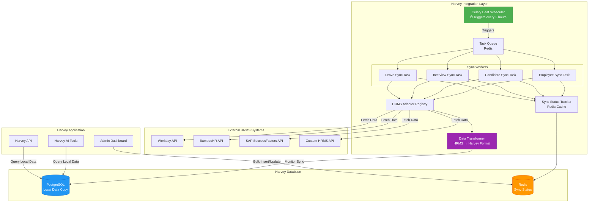
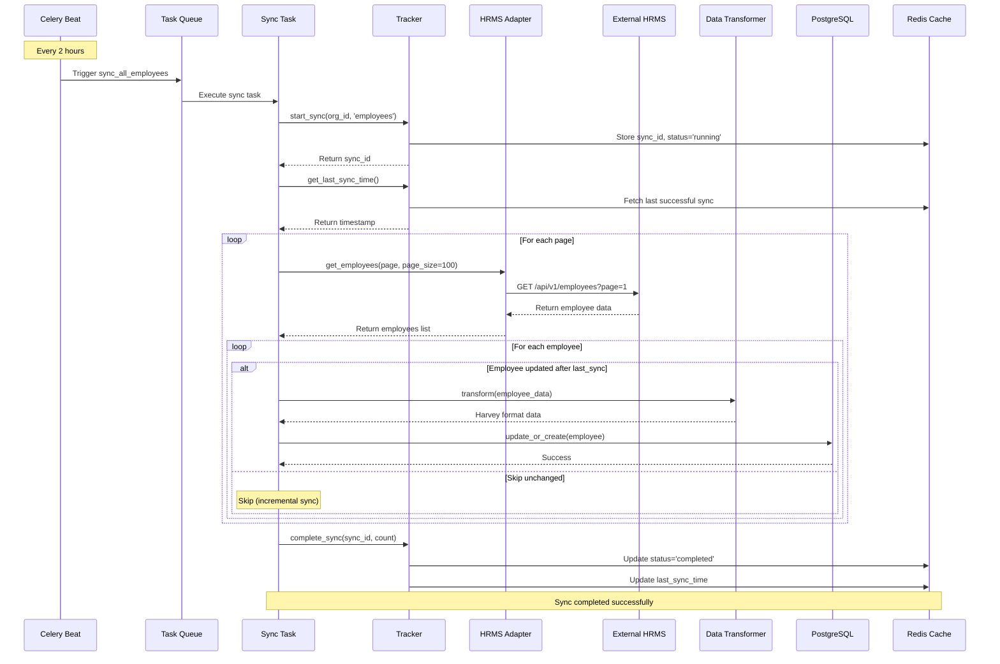
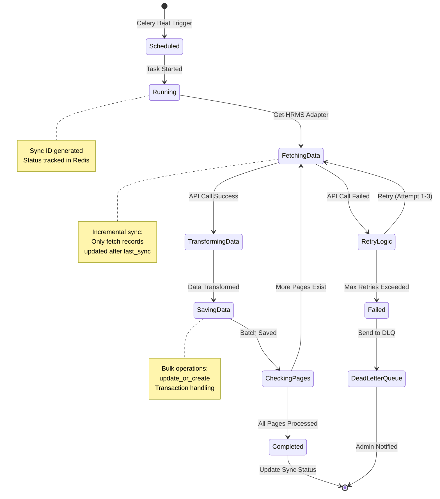
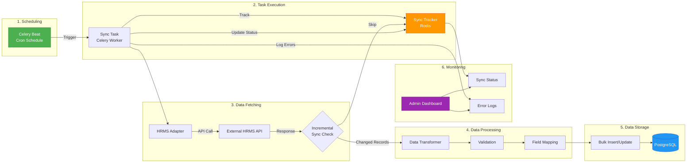
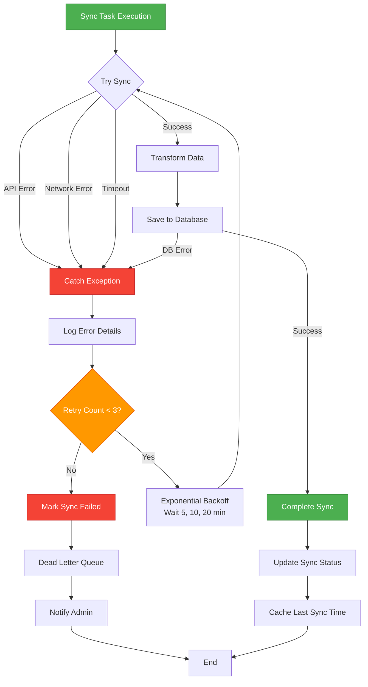
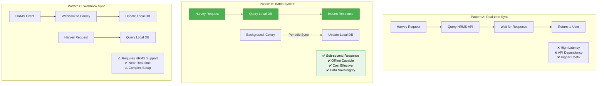
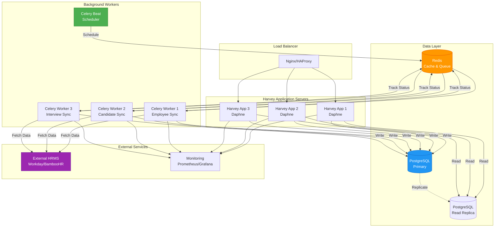
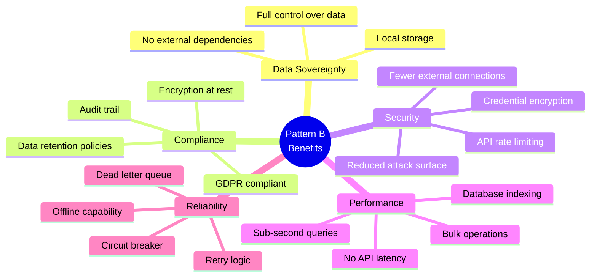

# HR Integration Architecture - Visual Diagrams

This document contains detailed visual diagrams for the HR system integration architecture, with a focus on **Pattern B: Scheduled Batch Sync** - the recommended production approach.

---

## Pattern B: Scheduled Batch Sync Architecture

### High-Level Architecture

---

## Detailed Sync Workflow

### Employee Sync Process

---

## Sync Task State Machine

---

## Data Flow Architecture

---

## Sync Frequency Strategy

```mermaid
gantt
    title HR Data Sync Schedule (Pattern B)
    dateFormat HH:mm
    axisFormat %H:%M

    section Employees
    Sync Every 2 Hours    :active, emp1, 00:00, 2h
    Sync Every 2 Hours    :active, emp2, 02:00, 2h
    Sync Every 2 Hours    :active, emp3, 04:00, 2h
    Sync Every 2 Hours    :active, emp4, 06:00, 2h

    section Candidates
    Sync Every Hour       :crit, cand1, 00:00, 1h
    Sync Every Hour       :crit, cand2, 01:00, 1h
    Sync Every Hour       :crit, cand3, 02:00, 1h
    Sync Every Hour       :crit, cand4, 03:00, 1h

    section Interviews
    Sync Every 30 Min     :done, int1, 00:00, 30m
    Sync Every 30 Min     :done, int2, 00:30, 30m
    Sync Every 30 Min     :done, int3, 01:00, 30m
    Sync Every 30 Min     :done, int4, 01:30, 30m

    section Leave Requests
    Daily at 1 AM         :milestone, leave1, 01:00, 0m
```

---

## Error Handling Flow

---

## Pattern Comparison

---

## Production Deployment Architecture

---

## Key Benefits of Pattern B

### Performance Comparison

| Metric                 | Pattern A (Real-time) | Pattern B (Batch) ⭐ | Pattern C (Webhook) |
| ---------------------- | --------------------- | -------------------- | ------------------- |
| **Query Latency**      | 500-2000ms            | <50ms                | <50ms               |
| **Offline Capability** | ❌ No                 | ✅ Yes               | ✅ Yes              |
| **API Calls/Day**      | 10,000+               | 50-100               | Event-based         |
| **Data Freshness**     | Real-time             | 30min - 2hr          | Near real-time      |
| **Setup Complexity**   | Low                   | Medium               | High                |
| **HRMS Dependency**    | High                  | Low                  | Medium              |
| **Cost**               | High                  | Low                  | Medium              |
| **Production Ready**   | ⚠️ Demo Only          | ✅ Recommended       | ⚠️ If Supported     |

### Security & Compliance

---

## Implementation Checklist

### Phase 1: Setup (Week 1)

- [ ] Install Celery and Redis
- [ ] Create HRMS adapter base class
- [ ] Implement mock adapter for testing
- [ ] Set up Celery Beat scheduler

### Phase 2: Core Sync (Week 2)

- [ ] Implement employee sync task
- [ ] Implement candidate sync task
- [ ] Implement interview sync task
- [ ] Add sync status tracker

### Phase 3: Optimization (Week 3)

- [ ] Add incremental sync logic
- [ ] Implement bulk database operations
- [ ] Add Redis caching layer
- [ ] Optimize database queries

### Phase 4: Production (Week 4)

- [ ] Add error handling and retries
- [ ] Implement monitoring dashboard
- [ ] Set up alerts and notifications
- [ ] Security audit and encryption
- [ ] Load testing and performance tuning

---

## Monitoring Dashboard Preview

The admin dashboard should display:

1. **Sync Status Overview**
   - Last sync time for each entity type
   - Success/failure rates
   - Records synced in last 24 hours

2. **Active Syncs**
   - Currently running sync operations
   - Progress indicators
   - Estimated completion time

3. **Error Logs**
   - Recent failures
   - Error messages
   - Retry attempts

4. **Performance Metrics**
   - Average sync duration
   - API response times
   - Database write performance

---

_For complete implementation details, see [HR_INTEGRATION.md](./HR_INTEGRATION.md)_
