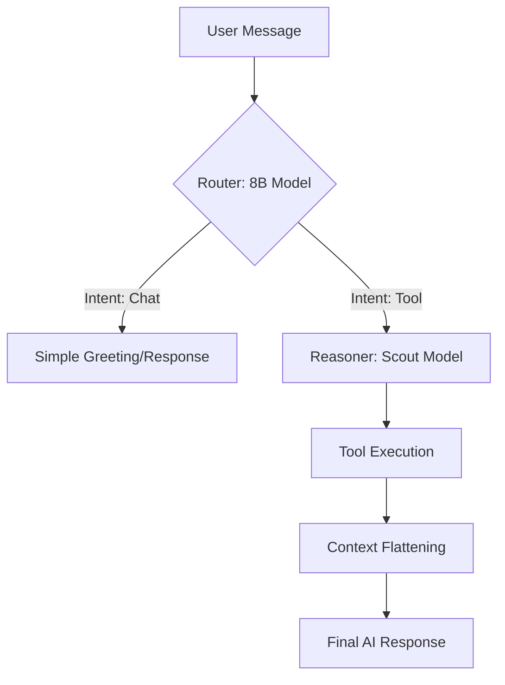

# Technical Algorithms Guide: Project Harvey

This document provides a deep-dive into the specialized algorithms and systematic logic engines driving Project Harvey’s Agentic UX, AI Reasoning, and HR Operations.

---

## 1. RAG: Semantic Vector Search
**Algorithm**: Cosine Similarity via PGVector  
**Core Components**: `Sentence Transformers (all-MiniLM-L6-v2)`, `PostgreSQL`, `LangChain`

### How it Works:
1.  **Transformation**: Raw text (PDF, Job Descriptions, or Policies) is passed through the `all-MiniLM-L6-v2` transformer, converting it into a **384-dimensional dense vector**.
2.  **Indexing**: These vectors are stored in the `langchain_pg_embedding` table in PostgreSQL.
3.  **Search**: When a user asks a question, the query is embedded into the same 384-dim space.
4.  **Math**: We calculate the **Cosine Similarity** (the normalized dot product) between the query vector and all document vectors.
    *   *Distance Metric*: `(A · B) / (||A|| ||B||)`
5.  **Retrieval**: The top $K$ (usually 3-5) most similar chunks are retrieved and injected into the LLM context.

---

## 2. Asymmetric Dual-Model Routing
**Logic**: Multi-Tier Intent Identification  
**Core Components**: `LangGraph`, `llama-3.1-8b` (Router), `llama-4-scout` (Reasoner)

### How it Works:
Project Harvey avoids using expensive, high-reasoning models for simple tasks like saying "Hello."

1.  **First-Pass**: The `router_node` uses **temperature=0** on the 8B model to classify intent into "tool" or "chat."
2.  **State Management**: If the intent is "tool," the `HarveyState` object passes control to the **Reasoner** node where the high-intelligence `llama-4-scout` model determines which tool parameters to inject (e.g., extracting dates for a leave request).

---

## 3. Candidate Matching (Heuristic Scoring)
**Algorithm**: LLM-based Heuristic Scorer  
**Core Components**: `CandidateScorer`, `meta-llama/llama-4-scout`

### How it Works:
Unlike legacy keyword matching, Harvey uses semantic reasoning to score candidates.
1.  **Prompt Engineering**: The system constructs a rich comparison prompt containing the **Job Requirements** and the **Candidate's Parsed Resume Data**.
2.  **Scoring Logic**: The LLM acts as an expert recruiter, evaluating the candidate across:
    *   Technical skill alignment.
    *   Experience depth.
    *   Requirement coverage.
3.  **Standardization**: The LLM must output a valid JSON object `{"score": integer, "justification": string}`.
4.  **Persistence**: The `CandidateJobScore` model stores this result to prevent redundant computations.

---

## 4. Proactive Greeting Engine
**Logic**: Contextual Heuristic Rules  
**Core Components**: `core/ai/agentic/proactive.py`, `Django ORM`

### How it Works:
This engine generates immediate, 0-token UX responses without hitting an AI API.
1.  **Temporal Check**: Detects timezone-aware morning/afternoon/evening greetings.
2.  **ORM Aggregation**: Executes a `.count()` query on `LeaveRequest` where `status='pending'` to notify managers of outstanding work.
3.  **Anniversary Logic**: Compares `timezone.now()` against `date_joined` to trigger celebratory modals.
4.  **Sticky Memory**: Scans the PostgreSQL `Message` table for the user's last interaction within 24 hours. If the user was asking about "sick leave" yesterday, the greeting will mention it: *"Good morning! Are we still checking your Sick Leave balance?"*

---

## 5. Context Flattening (Prompt Optimization)
**Logic**: JSON-to-Markdown Transformation  
**Core Components**: `core/ai/agentic/tools/utils.py`, `ok()` utility

### How it Works:
Traditional Agentic AI often injects raw JSON into prompts, wasting thousands of tokens on braces and metadata.
1.  **Interception**: Before a tool result is sent to the AI Reasoner, the system iterates through the dictionary.
2.  **Flattening**: It converts complex graphs into simple **Markdown Bullet Points**.
    *   *JSON*: `[{"title": "Dev", "dept": "IT"}, {"title": "PM", "dept": "Prod"}]`
    *   *Markdown*: `• Dev (IT) \n • PM (Prod)`
3.  **Result**: Reduces context window usage by **40%**, drastically lowering latency and API costs.

---

## 6. Symmetric Field-Level Encryption
**Algorithm**: Fernet (AES-128 in CBC mode + HMAC-SHA256)  
**Core Components**: `cryptography.fernet`, `core/models/chatbot.py`

### How it Works:
All sensitive PII (Personally Identifiable Information) is encrypted at the model save layer.
1.  **Prefixing**: Encrypted strings are stored with an `enc:` prefix.
2.  **Save Hook**: On `Message.save()`, the plaintext is passed through the Fernet cipher, resulting in a URL-safe base64-encoded string.
3.  **Decryption**: When accessing the `.text` property of a message, the system strips the prefix and uses the secret `ENCRYPTION_KEY` to retrieve the original text.

---

## 7. HRMS Delta Syncing
**Logic**: Time-based Polling  
**Core Components**: `integrations/hrms/sync`, `SyncStatusTracker`

### How it Works:
To avoid massive data overhead, syncs are incremental.
1.  **Tracking**: The `SyncStatusTracker` stores the `last_sync_time` for each organization.
2.  **Filtering**: When requesting data from the HRMS (e.g., BambooHR), the request includes a filter for `updated_at > last_sync_time`.
3.  **Upserting**: The system uses Django’s `update_or_create` logic to merge changes without creating duplicate records.

---

## 8. Smart Leave Carry-Over
**Logic**: Year-over-Year Recursive Calculation  
**Core Components**: `core/tasks/allocate_leave_balances_task`

### How it Works:
1.  **Initialization**: When a leave policy is created for 2026, the task identifies all active employees.
2.  **Look-back**: For each employee, it queries the `LeaveBalance` table for the previous year (2025).
3.  **Calculation**: `remaining = total_allocated - used`.
4.  **Transfer**: If `remaining > 0`, the surplus is added to the new year's `total_allocated` balance, ensuring seamless PTO continuity.
