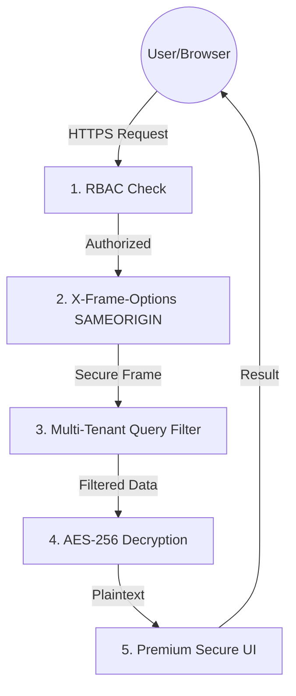
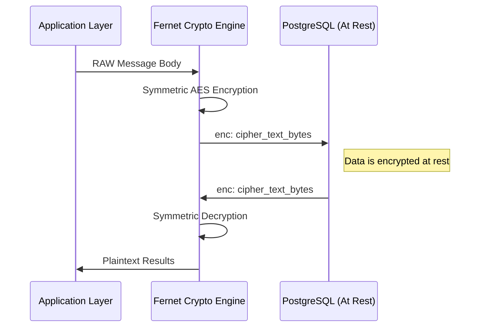
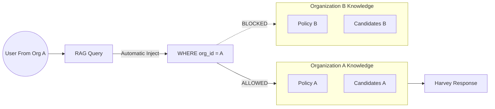
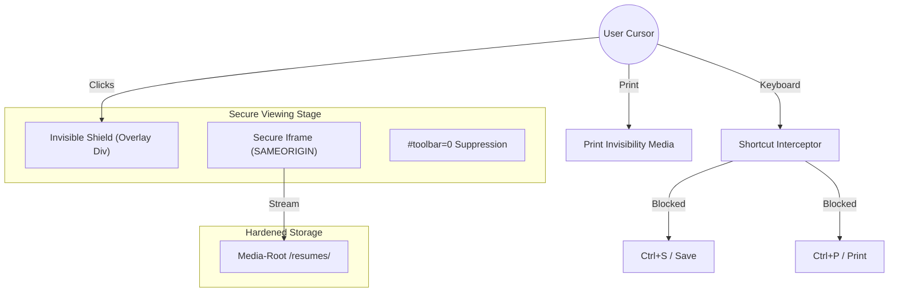

# Project Harvey: Security Architecture & Data Sovereignty

Project Harvey is engineered with a **Defense-in-Depth** philosophy. In the HR technology sector, security is not a feature—it is a mandatory prerequisite for operational trust and legal compliance.

---

## 1. System-Wide Request Pipeline (The Security Gauntlet)
Every interaction with Project Harvey passes through a layered "Security Gauntlet" before any data is served.

### Theoretical Detail: The "On-Fail-Deny" Logic
Harvey uses a pessimistic security model. If a request is missing an `organization_id` context or fails a header validation, the system defaults to a **TCP/403 Forbidden** before any database thread is spun up. This minimizes the "Attack Surface" by preventing the AI agent from even acknowledging an unauthorized query.

---

## 2. At-Rest Cryptographic Shielding (The Cryptographic Root)
Harvey ensures that the database is not a "single point of failure" for data privacy.

### The Primitive: Fernet (AES-128-CBC + HMAC-SHA256)
Harvey utilizes the **Fernet** implementation of symmetric encryption. 
*   **Theory**: Unlike simple AES, Fernet provides **Authenticated Encryption**. Every record is signed with a keyed Hash-based Message Authentication Code (HMAC).
*   **The "enc:" Prefix Logic**: Encrypted records are transparently tagged. This allows the Application Layer to dynamically identify and decrypt content on-the-fly, ensuring that a database administrator or a direct SQL attacker sees only high-entropy, authenticated ciphertext.

---

## 3. Multi-Tenant Logical Isolation (Semantic Containment)
Harvey is a "Fortress in the Cloud." Our RAG (Retrieval Augmented Generation) pipeline is strictly siloed.

### Logical vs. Physical Isolation
While Harvey uses a shared database, it enforces **Logical Isolation**. Every table is partitioned by a `tenant_id`.
*   **Semantic Constraint**: In our RAG pipeline, the "AI Brain" doesn't just scan all documents. Every vector search query is strictly appended with a metadata filter: `WHERE metadata.org_id = CURRENT_USER_ORG`. This ensures that even "hallucinations" or edge-case retrievals can NEVER bridge the gap between two different corporate datasets.

---

## 4. Secure Document Theater (The Anti-Exfiltration Layer)
Our "Proactive Privacy" layer for corporate policies and candidate resumes.

### Theory: The Psychological Friction Model
No client-side document viewing is 100% "hacker-proof" (due to the display hardware itself), but Harvey implements the **Friction Theory**. By removing the *easiest* and *most common* vectors of exfiltration (the toolbar and the print button), we incentivize users to keep data within the platform.
*   **X-Frame-Options (SAMEORIGIN)**: This is our primary firewall against "UI Redressing." It ensures that no third-party site can overlay an invisible "Download" button on top of our document viewer.
*   **The Click-Shield Overlay**: A high-index Z-layer intercepts mouse-events, preventing the browser's native PDF-context menus from triggering over sensitive areas.

---

## 5. Summary of Enterprise Compliance
| Layer | Core Theory | Implementation | Non-Negotiable Rationale |
| :--- | :--- | :--- | :--- |
| **Cryptography** | Authenticated AES | Fernet Symmetric | Legal/Compliance (GDPR Article 32) |
| **Isolation** | Logical Row-Level Security | Metadata Scoping | SaaS Integrity & Reputation Protection |
| **Theater** | Friction-Based Defense | Frame Suppression | Intellectual Property & PII Sovereignty |
| **RBAC** | Principle of Least Privilege | Permission Decorators | Risk Mitigation for Insider Threats |

---
*Last Updated: April 9, 2026*
*Security Protocol Version: 2.5*
