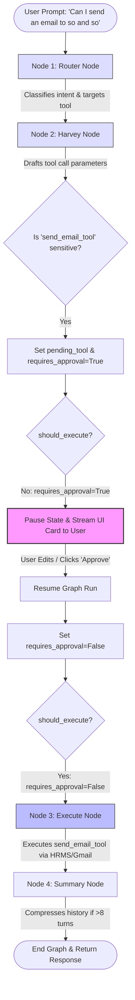

# Harvey AI Node Execution Flow

This document explains how the LangGraph nodes coordinate during a user prompt execution, specifically tracing the path of the query: 
**"Can I send an email to so and so"**

---

## 1. Node Flow Diagram

This Mermaid diagram illustrates the lifecycle of the LangGraph state machine, highlighting the **Human-in-the-Loop (HIL)** pause and user confirmation cycle.



---

## 2. Step-by-Step Execution Lifecycle

### Step 1: User Request Ingestion
* **Input:** User sends: *"Can I send an email to John Doe..."*
* **Trigger:** The Django WebSocket consumer (or REST controller) intercepts the prompt and invokes `generate_llm_reply` in `chat_service.py` to start the LangGraph runtime.

### Step 2: Router Node (`router_node` in `router.py`)
* **Model:** Llama-3.1-8B (fast, low temperature).
* **Action:** Parses the raw query. Because "send" and "email" are detected, it classifies the message under `intent: "tool"` and targets `target_tool: "send_email_tool"`.
* **State Updates:** Writes `intent = "tool"` and `target_tool = "send_email_tool"` to the graph state.

### Step 3: Harvey Node (`harvey_node` in `harvey.py`)
* **Model:** Llama 4 Scout 17B (reasoner).
* **Action:** Because intent is `"tool"`, the target tool `send_email_tool` is dynamically bound to the LLM. 
* **Drafting:** The LLM drafts the parameter arguments (e.g., `recipient_email`, `subject`, `body`).
* **HIL Interception:** The node detects that `send_email_tool` is part of the `sensitive_tools` registry.
* **State Updates:** 
  * Injects the tool call parameters into `pending_tool`.
  * Sets `requires_approval = True`.
  * Returns the state updates, suppressing internal LLM narration content to avoid leakage to the user.

### Step 4: Routing Gate (`should_execute`)
* **Action:** The conditional routing edge evaluates whether to run the execution node:
  ```python
  return bool(pending) and not requires_approval
  ```
* **Decision:** Since `requires_approval = True`, the routing function evaluates to `False`. The graph transitions to the END state without executing the tool, saving the thread state.

### Step 5: User Action Intervention (Frontend)
* **Payload:** The backend pushes the draft parameters to the user as an interactive card.
* **Human Action:** The user edits the email body or recipient address directly in the UI and clicks **"Approve"**.
* **Resume Request:** A WebSocket request containing `action="approve_tool"` and the updated parameters is sent to the server.

### Step 6: Graph Resumption & Execute Node (`execute_node` in `execute.py`)
* **State Modification:** The server updates the state on the active thread, replacing the drafted arguments in `pending_tool` with the user's validated inputs and setting `requires_approval = False`.
* **Execution:** The graph is run again. This time, `should_execute` evaluates to `True`.
* **Node Action:** `execute_node` resolves the Python tool reference from the registry and runs the actual function (sending the email via Gmail API and writing a log to the database). It returns a `ToolMessage` containing the success response.

### Step 7: Memory Consolidation (`summary_node` in `summary.py`)
* **Action:** Checks the size of the conversation window. If it exceeds 8 messages, it compresses the chat history into a short abstract summary to save context tokens for subsequent interactions.
* **End:** Returns the finalized result to the user.
