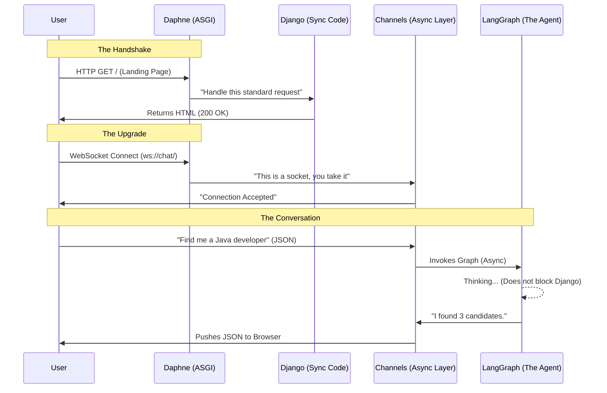
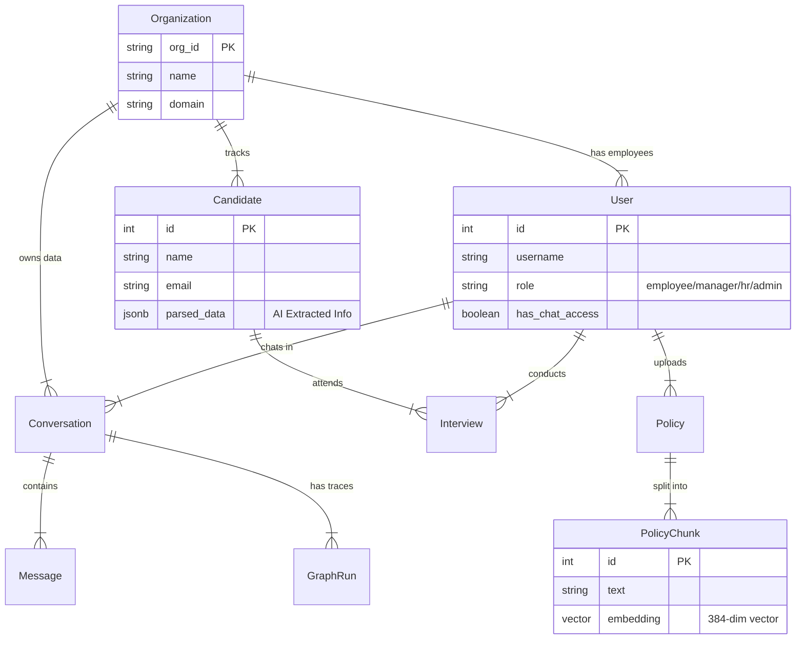

# Project Harvey: The Definitive Technical Guide

**Version**: 2.1 (Deep Dive + Database Internals)
**Target Audience**: Developers who need to master the codebase.

---

## 🔒 1. Architecture: The "Real" View

Project Harvey is not just a Django app; it is a **Hybrid Async/Sync System**.

### The "Two-Brain" Problem
Most Django apps are synchronous (Sync). They wait for the database, they wait for the file system.
AI Agents are slow. They take 3-10 seconds to "think". If we used standard Django for this, your server would freeze for everyone else while one person waited for a reply.

### The Solution: The "Traffic Cop" Architecture
We use **Daphne** as a traffic cop sitting in front of Django.



---

## ❓ 2. "Why Did We Choose This?" (Defense of Tech Stack)

### A. Why Daphne over Gunicorn?
*   **Gunicorn**: Is a WSGI server. It speaks "HTTP 1.0" essentially. It receives a request, computes, returns, and closes. It **cannot** handle a WebSocket.
*   **Daphne**: Is an ASGI server. It keeps the line open. It can handle thousands of idle connections (people staring at the chat screen) with very little RAM.

### B. Why LangGraph over Standard LangChain?
*   **LangChain (Chains)**: Good for "A -> B -> C". Input -> Prompt -> LLM -> Parser -> Output.
*   **LangGraph (State Machines)**: The Agent needs to *loop*.
    *   *Scenario*: User asks "Check if John is free". Agent checks calendar -> Calendar says "Error: Which John?". Agent needs to **go back** and ask the user "John Doe or John Smith?".
    *   **Cycles**: LangGraph allows `HARVEY -> TOOL -> HARVEY`. Standard LangChain struggles with this "retry/clarify" loop without messy `while` loops in Python.
    *   **Persistence**: LangGraph saves the *state* (variables) to SQLite (`checkpoints.db`) at every step. If the server crashes mid-thought, we can resume exactly where we were.

### C. Why Postgres + PGVector (and not Pinecone/Chroma)?
*   **The "Split Brain" Problem**: If you store Users in Postgres and Resume Vectors in Pinecone, you have to keep them in sync. If you delete a User, you must remember to delete their vector in the other DB.
*   **The Single Truth**: With **PGVector**, the vector is just a column `embedding vector(384)` on the `Candidate` table.
    *   *Query*: "Select candidates where name is 'John' AND vector is close to 'Python Developer'".
    *   You can mix SQL filters and AI semantic search in **one efficient query**.

### D. Why **Django**? (vs FastAPI/Flask)
**Answer**:
*   **Batteries Included**: We need an Admin Panel, User Authentication, ORM, and Database Migrations from Day 1.
    *   *Flask*: You have to paste together 5 different libraries (SQLAlchemy, Flask-Login, Alembic, etc.).
    *   *Django*: It's all built-in. `core.models.User` is ready to go. The Admin Panel lets us inspect `GraphRun` traces without writing a single line of frontend code.
*   **Ecosystem**: Django Channels is the most mature WebSocket library in the Python world. It integrates perfectly with Django's Auth system (so we know *who* is on the socket).

### E. Why **Redis**?
**Answer**:
*   **The Glue**: WebSockets are stateful. HTTP is stateless. Redis acts as the "Channel Layer" message bus.
    *   When the AI finishes thinking (in a background worker trace), it needs to send a message to "Socket ID 123".
    *   It publishes to Redis: `PUBLISH channel_123 "{response: 'Hello'}"`.
    *   Daphne (listening to Redis) picks it up and pushes it to the user's browser.
*   **Caching**: We use it to store "throttling" keys (e.g., prevent User X from spamming the LLM).

### F. Cost & Latency (Do we call the LLM twice?)
**Answer**: It depends on what the user asks. The Agent is dynamic.

*   **Scenario A: Simple Chit-Chat** ("Hi", "What is your name?")
    *   **1 Call**.
    *   `HARVEY` Node -> Output ("I am Harvey").
    *   *Latency*: ~1-2 seconds.
*   **Scenario B: Tool Usage** (User: "Schedule an interview with Steve")
    *   **Total Calls: 2 to Groq/Gemini**
    *   **Call #1 (Decision)**:
        *   *Input*: "Schedule interview with Steve"
        *   *Output*: `null` (Content), `tool_calls=[{name: 'schedule_interview', args: {'name': 'Steve'}}]`
        *   *Action*: The Python code pauses, executes `schedule_interview('Steve')`, and gets back "Success: Interview created ID 55".
    *   **Call #2 (Confirmation)**:
        *   *Input*: "User said schedule... I called tool... Tool said Success."
        *   *Output*: "I have scheduled the interview with Steve." (Content)
    *   *Latency*: ~4-7 seconds.
*   **Scenario C: Multi-step Reasoning** ("Check calendar, then email John")
    *   **3+ Calls**.
        1.  "Check calendar" (Call 1) -> Tool Output.
        2.  "Okay, calendar is free. Now send email." (Call 2) -> Tool Output.
        2.  "Okay, calendar is free. Now send email." (Call 2) -> Tool Output.
        3.  "Email sent." (Call 3).

### G. Can We Lower the API Call Rate? (Optimization)
**Answer**: Yes, but it comes with risks.
The **2-step** process (Decide -> Confirm) is the industry standard "ReAct" (Reason + Act) pattern. It is the safest way to ensure the AI definitely knows the tool succeeded before telling the user.

*   **Optimization 1: "Fire and Forget" (1 Call)**
    *   *Technique*: We can modify the code to run the tool and *immediately* return a generic "I'm doing it" message without waiting for the tool to finish.
    *   *Risk*: If the tool fails (e.g., "Calendar full"), the user sees "Done!" but it actually failed. This creates "Silent Failures".
*   **Optimization 2: Parallel Tool Calling**
    *   *Technique*: If the user says "Email John AND Steve", modern LLMs can output *two* tool calls in one JSON response.
    *   *Status*: **Supported**. Our loop handles lists of tool calls, so it will execute both in parallel and then do just 1 confirmation call. This is efficient.

---

---

## 📚 3. Component Deep Dive

### A. The "Prompt" (`core/llm_graph/harvey_prompt.py`)
This is the "personality" injected into the LLM. It's not just "You are helpful." It is a structured algorithm in text form.

*   **Context Block**: We dynamically inject `{extracted_info}` (facts we learned previously) so the AI doesn't ask "What is your name?" twice.
*   **Rule 5 (Action Reality)**: *Critical*. "You cannot perform actions by just saying so." This prevents the AI from hallucinating success ("I have sent the email") when it actually failed to call the tool.

### B. The "State" (`core/llm_graph/state.py`)
Think of `HarveyState` as the "RAM" of the Agent.
```python
class HarveyState(TypedDict):
    messages: list       # The verbal conversation
    user_id: int         # Who are we talking to?
    context: dict        # Long-term memory (User name, job title)
    pending_tool: dict   # "I want to run tool X with args Y"
    trace: list          # Debugging log for us developers
```

### C. The "Router" (`core/llm_graph/graph.py`)
This file wires the brain.
*   `workflow.add_conditional_edges("HARVEY", should_execute, ...)`
*   **Logic**:
    1.  Run `HARVEY` node (LLM thinks).
    2.  Check `should_execute`: Did `HARVEY` put something in `pending_tool`?
        *   **YES**: Go to `TOOL` node.
        *   **NO**: Go to `SUM` (Summarize) node, then END.

---

## 🗄️ 4. Data Model & Schema (DDL)

### Entity Relationship Diagram (ERD)



### DDL Tables (SQL Schema Definitions)

Below are the approximate SQL definitions (Postgres dialect) generated by Django.

#### `core_organization`
```sql
CREATE TABLE core_organization (
    id bigint NOT NULL PRIMARY KEY GENERATED BY DEFAULT AS IDENTITY,
    org_id varchar(50) NOT NULL UNIQUE,
    name varchar(255) NOT NULL,
    domain varchar(100) UNIQUE,
    created_at timestamp WITH time zone NOT NULL,
    updated_at timestamp WITH time zone NOT NULL
);
```

#### `core_user` (Extends Auth User)
```sql
CREATE TABLE core_user (
    id bigint NOT NULL PRIMARY KEY GENERATED BY DEFAULT AS IDENTITY,
    -- Standard Auth Fields (password, last_login, etc...)
    role varchar(50) NOT NULL DEFAULT 'employee',
    has_chat_access boolean NOT NULL DEFAULT true,
    organization_id bigint REFERENCES core_organization(id)
);
```

#### `core_candidate`
```sql
CREATE TABLE core_candidate (
    id bigint NOT NULL PRIMARY KEY GENERATED BY DEFAULT AS IDENTITY,
    name varchar(255) NOT NULL,
    email varchar(254) NOT NULL UNIQUE,
    resume_file varchar(100) NOT NULL,
    parsed_data jsonb NULL, -- The AI magic happens here
    status varchar(50) NOT NULL DEFAULT 'pending',
    organization_id bigint NOT NULL REFERENCES core_organization(id)
);
```

#### `core_policychunk` (The Vector Store)
This is where **RAG** (Retrieval Augmented Generation) lives.
```sql
CREATE TABLE core_policychunk (
    id bigint NOT NULL PRIMARY KEY GENERATED BY DEFAULT AS IDENTITY,
    chunk_index integer NOT NULL CHECK (chunk_index >= 0),
    text text NOT NULL,
    policy_id bigint NOT NULL REFERENCES core_policy(id),
    
    -- The Special PGVector Column
    embedding vector(384) NULL  
);
```

---

## 🛠️ 5. Data Manipulation (DML)

How we actually read/write this data in the code.

### A. Inserting Data (Django ORM vs SQL)

**Scenario**: Adding a new candidate from a PDF upload.

*   **Django ORM (Python Code)**:
    ```python
    Candidate.objects.create(
        organization=request.user.organization,
        name="John Doe",
        email="john@example.com",
        parsed_data={"skills": ["Python", "Django"]}
    )
    ```

*   **Resulting SQL**:
    ```sql
    INSERT INTO core_candidate (organization_id, name, email, parsed_data, status)
    VALUES (1, 'John Doe', 'john@example.com', '{"skills": ["Python", "Django"]}', 'pending');
    ```

### B. Querying Vectors (The "AI Search")

**Scenario**: Finding policies related to "Maternity Leave".

*   **Code (simplified)**:
    ```python
    # 1. Convert text query to numbers (embedding)
    query_vector = embeddings_model.embed_query("Maternity Leave") 
    
    # 2. Ask Postgres for nearest neighbors
    # This uses the <=> operator (Cosine Distance)
    chunks = PolicyChunk.objects.order_by(
        Op(F('embedding'), query_vector, kind='cosine_distance')
    )[:3]
    ```

*   **Resulting SQL**:
    ```sql
    SELECT * FROM core_policychunk
    ORDER BY embedding <=> '[0.12, -0.45, ... 384 numbers ...]'
    LIMIT 3;
    ```

### C. Using JSONB Columns

**Scenario**: Finding candidates who know "Python" (stored in JSON).

*   **Django ORM**:
    ```python
    Candidate.objects.filter(parsed_data__skills__contains=["Python"])
    ```

*   **Resulting SQL**:
    ```sql
    SELECT * FROM core_candidate
    WHERE parsed_data -> 'skills' @> '["Python"]';
    ```

---

## 🕵️ 6. Trace: "Day in the Life of a Request"

Here is exactly what happens when you press "Send" in the UI.

1.  **Browser**: `socket.send({prompt: "Schedule interview"})`
2.  **Daphne**: Intercepts frame, routes to `ChatConsumer`.
3.  **ChatConsumer**: `await sync_to_async(generate_llm_reply)`.
4.  **ChatService**:
    *   Creates transaction.
    *   Inserts `Conversation` row.
    *   Inserts `GraphRun` (status='running').
5.  **LangGraph**:
    *   **HARVEY Node**: Reads `history`. Calls LLM.
    *   **Decision**: LLM says "Call Tool".
    *   **TOOL Node**: Inserts `Interview` row (DML `INSERT`).
6.  **Response**:
    *   `ChatService` updates `GraphRun` (status='success').
    *   Inserts `Message` row.
    *   Returns text.
7.  **Consumer**: Sends JSON back to user.

---

## 🔧 7. Routing Dictionary (`urls.py`)

*   `http://localhost:8000/` -> `core.views.landing_page`
*   `http://localhost:8000/app/` -> `core.views.chat_page` (The Main UI)
*   `ws://localhost:8000/ws/chat/` -> `core.consumers.ChatConsumer` (The Socket)
*   `http://localhost:8000/chat/` -> `core.views.chat_with_llm` (Legacy HTTP endpoint).

---

## 🧪 8. How to Verify/Debug

1.  **"Is Redis running?"**: Channels needs Redis.
2.  **"Did the Tool crash?"**: Look at `core_graphrun` table.
3.  **"Why did it pick that policy?"**: Check `core_policychunk` embeddings. If vectors are all Zeros, the embedding model failed.

---

## 🔐 9. Identity & Integrations (The OAuth System)

We use a **Two-Tier OAuth Strategy** to solve the "Unverified App" problem.

### The Problem
Google restricts sensitive scopes (like `gmail.send`) for unverified apps. If every user who logs in is asked for permission to send emails, they will see a "This app isn't verified" warning, and you (the dev) have to manually add them as Testers. This is not scalable.

### The Solution: "System Token" vs "User Token"

1.  **User Token (Login)**:
    *   **Scopes**: `email`, `profile` (openid).
    *   **Risk**: Low. Google allows this for anyone without scary warnings.
    *   **Purpose**: Authentication only. "Who are you?"

2.  **System Token (Backend)**:
    *   **Scopes**: `https://www.googleapis.com/auth/gmail.send`.
    *   **Storage**: Encrypted/Stored in `GOOGLE_SYSTEM_REFRESH_TOKEN` env var.
    *   **Purpose**: The *System* sends emails, not the *User*. When Admin Alice clicks "Invite Bob", the code uses the **System Token** to send the email from `no-reply@yourorg.com` (or the system account), not from Alice's personal Gmail.

### The Invite Flow
1.  **Admin** creates Invite -> Insert `Invite` row (Token: `UUID`).
2.  **System** sends HTML Email with link: `/auth/google/login?invite=UUID`.
3.  **New User** clicks link -> Logs in with Google.
4.  **Callback**:
    *   Code checks `request.session['invite_token']`.
    *   Finds `Invite` row.
    *   Creates `User` linked to `Invite.organization`.
    *   Deletes `Invite` (One-time use).

