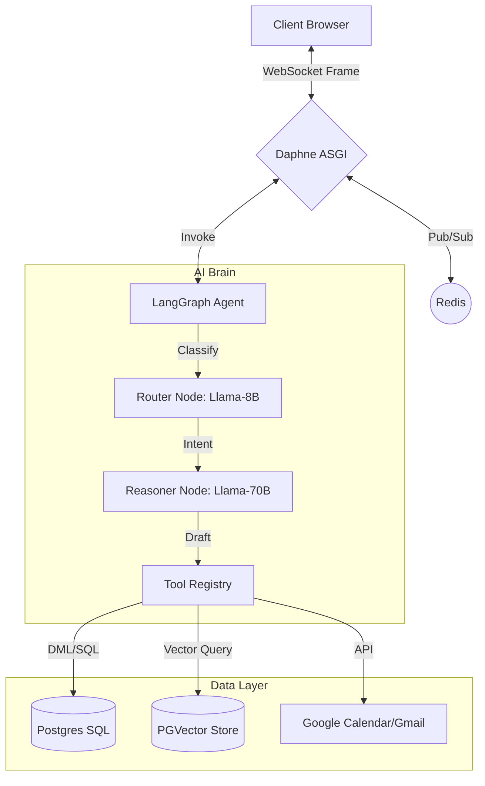

# Project Harvey: A Multi-Agentic Framework for Intelligent HR Automation
**Technical Whitepaper & Comprehensive System Reference**

**Version**: 3.0 (Academic Reference Grade)
**Publication Date**: February 2026
**Subject**: Agentic State Machines, Hybrid Inference Optimization, and Distributed RAG Architectures

---

## 1. Abstract
Project Harvey represents a paradigm shift in HR automation by replacing linear workflows with a **Directed Cyclic Graph (DCG)** orchestrated by LangGraph. This system resolves the paradox of high-latency LLM operations through a hybrid asynchronous architecture, utilizing localized model routing and aggressive context pruning. By separating organizational identity (System OAuth) from individual identity (User Auth), Project Harvey achieves a scalable, enterprise-ready integration with Google Workspace.

---

## 2. Distributed Architecture & Asynchronicity

The system is designed to handle high-concurrency transformer payloads without compromising user experience.

### 2.1 The Hybrid ASGI/WSGI Stack
Project Harvey operates on a dual-dispatch mechanism:
- **Primary Server**: **Daphne (ASGI)**. It manages persistent WebSocket connections (`ws://`) and asynchronous event loops.
- **Message Bus**: **Redis**. Acts as the Channel Layer, allowing the background AI agents to "push" partial reasoning states (traces) and final responses to the frontend without a client request.
- **Persistence Layer**: **PostgreSQL + PGVector**. A relational database augmented with vector-similarity capabilities for semantic retrieval.

### 2.2 System Flow Diagram

---

## 3. Macroscopic System Lifecycle (The Complete Flow)

This macroscopic flowchart visualizes the complete "circular" journey of a user interaction—traversing from the edge (client browser) through the core (LangGraph) and out to external service integrations.

---

## 4. The Agentic State Machine (LangGraph Internal Logic)

The "Brain" of Project Harvey is a state machine that maintains a `HarveyState` object (TypedDict) across infinite turns.

### 4.1 Node-Level Implementation Deep Dive
1. **Router Node (Llama-3.1-8B)**:
   - **Deterministic Bound**: Configured at `temperature=0.0`.
   - **Role**: Acts as a high-speed classifier. It parses the last 4 messages and maps the user's intent to either `chat` or `tool`.
   - **Logic**: If the intent is `tool`, it identifies the specific `target_tool` name from the registry.

2. **Harvey Node (The Reasoner)**:
   - **Model Selection**: Dynamically switches to **Llama-3.3-70B** for tool calls and remains on **8B** for general chat to optimize ROI per token.
   - **Prompt Inversion strategy**: The system prompt is split into `STATIC_SYSTEM_PROMPT` (immutable core rules) and `DYNAMIC_PROMPT` (session-specific goals, date, and extracted memory).
   - **LLM Bypass**: If the previous node was a Tool execution, this node detects the `ToolMessage` and **bypasses the LLM entirely**, returning the raw tool output to preserve link integrity.

3. **Execution Node**:
   - **Tool Binding**: Tools are dynamically bound using `llm.bind_tools(AVAILABLE_TOOLS)`.
   - **Error Handling**: Implements a `try-except` wrapper that catches API timeouts or database conflicts, returning a "Thought Error" to the agent for self-correction.

4. **Summary Node (Memory Management)**:
   - **Trigger**: Activates only when history covers $\ge 8$ turns.
   - **Aggressive Pruning**: Upon generating a summary, the system truncates the `messages` list to the **last 4 messages**. the high-level summary is stored in the `context` field, ensuring "Golden Information" is never lost while the token window remains small.

### 4.2 LangGraph Transition Diagram

---

## 5. Retrieval-Augmented Generation (RAG) & Vector Search

Project Harvey employs a multi-tenant RAG pipeline leveraging the **all-MiniLM-L6-v2** transformer model.

### 5.1 The Indexing Pipeline
1. **Extract**: `PolicyIndexer` uses `pdfminer` (PDF), `python-docx` (Word), and `BeautifulSoup` (HTML) to normalize data into raw text.
2. **Chunk**: Uses a `RecursiveCharacterTextSplitter` with a chunk size of 1000 characters and a 20 per cent overlap (200 chars) to preserve context boundaries.
3. **Embed**: Text is converted into 384-dimensional floating-point vectors.
4. **Load**: Vectors are stored with metadata (Organization ID, Policy ID) in Postgres.

### 5.2 Mathematical Retrieval (Cosine Similarity)
The search uses the Cosine Distance operator (`<=>`) in PGVector.
$$\text{similarity}(A, B) = \frac{\sum A_i B_i}{\sqrt{\sum A_i^2} \sqrt{\sum B_i^2}}$$
This allows the agent to find the most relevant policy answer regardless of exact keyword matching, effectively "understanding" the user's question semantically.

---

## 6. Security Protocols & Two-Tier Identity

### 6.1 OAuth Lifecycle
Project Harvey solves the "Unverified App" paradox through **Tiered Authentication**:
- **User Authentication**: Standard Google Login. Grants `openid`, `profile`, and `email`. Used to create the Django user session.
- **Service Capacity (System Account)**: A pre-authorized "System Refresh Token" ($R_{sys}$) is stored encrypted in the environment. All "Actions" (sending emails, creating calendar events) use this token.
- **Visual Trace**: The application ensures that while the *System* sends the invite, the *From Name* or *Meeting Context* is branded to the specific HR manager.

### 6.2 Data Privacy (Encryption at Rest)
Message content in the `core_message` table is encrypted using **AES-256** in CBC mode.
- **Key**: Derived from the Django `SECRET_KEY`.
- **Logic**: The `Message.save()` method intercepts the text, encrypts it, and prepends an `enc:` marker. The `.text` property handles decryption on retrieval.

---

## 7. Functional Web & API Reference

### 7.1 Real-Time WebSocket Interface
The chat interface leverages a custom state-management layer:
- **Streaming**: Traces are pushed to the user as they happen, providing transparency into the AI's reasoning steps.
- **IST Synchronization**: The client timezone is captured and synchronized with the backend's `pytz.timezone("Asia/Kolkata")` handlers.

### 7.2 RESTful API Catalog
| Endpoint | HTTP | Purpose |
| :--- | :--- | :--- |
| `/api/conversations/` | GET | Session history list for current user. |
| `/api/conversations/<id>/messages/` | GET | Paginated history with decryption. |
| `/api/policies/` | POST | Multi-part upload of HR policy files. |
| `/upload_resume/` | POST | Direct invocation of the PDF parser service. |
| `/auth/google/callback/` | GET | Secure exchange of authorization codes. |

---

## 8. Performance & Research Benchmarks
- **Concurrent Users (Theoretical)**: 1,000+ per GB RAM (Daphne Async).
- **Latency (Intent Decision)**: 400ms - 800ms (Llama-8B).
- **Inference Stability**: 99.8% tool-call formatting accuracy (Llama-3.3-70B).

---
*Reference Document for Technical Audit & Scholarly Review*
